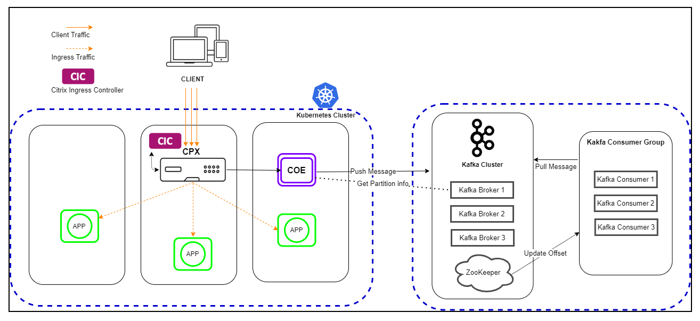
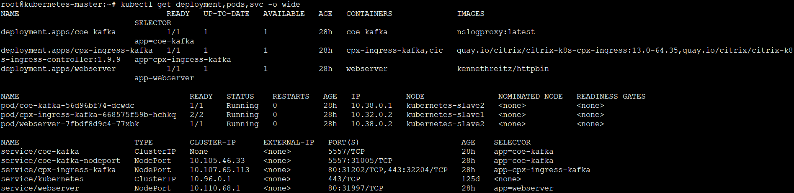
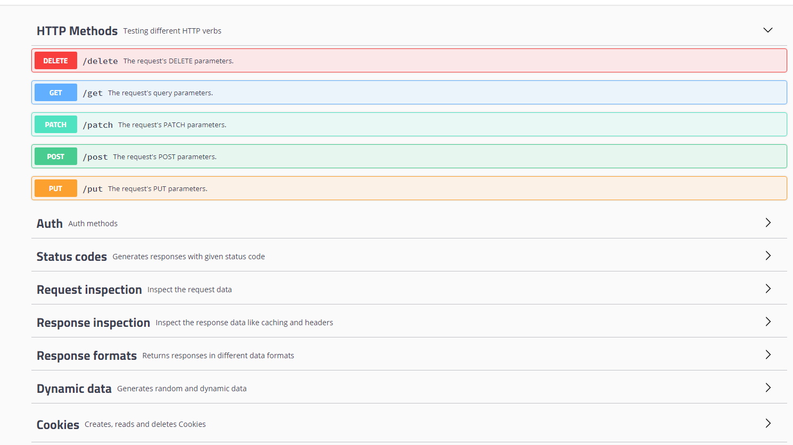
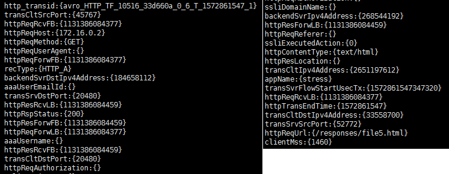

# Citrix ADC Observability Exporter with Kafka as endpoint

Citrix ADC Observability Exporter is a container that collects metrics and transactions from Citrix ADC. It also transforms the data into the formats (such as AVRO) that are supported in Kafka and exports the data to the endpoint. Kafka is an open-source and distributed event streaming platform for high-performance data pipelines and streaming analytics.

## Deploy Citrix ADC Observability Exporter

You can deploy Citrix ADC Observability Exporter using the YAML file. Based on the Citrix ADC deployment, you can use Citrix ADC Observability Exporter to export metrics and transaction data from Citrix ADC. You can deploy Citrix ADC CPX either as a pod inside the Kubernetes cluster or on Citrix ADC MPX or VPX form factor outside the cluster.

The following diagram illustrates a Citrix ADC as an Ingress Gateway with Citrix ADC Observability Exporter as a sidecar. It sends Citrix ADC application transaction data to Kafka.



### Prerequisites

  -  Ensure that you have a Kubernetes cluster with `kube-dns` or `CoreDNS` addon enabled.
  -  Ensure that the Kafka server is installed and configured.
  -  You must have a Kafka broker IP or FQDN address.
  -  You must have defined a Kafka topic *HTTP*.
  -  Ensure that you have Kafka Consumer to verify the data.

  **Note**: In this example scenario, the YAML file is used to deploy Citrix ADC Observability Exporter in the Kubernetes *defauIt* namespace. If you want to deploy in a private Kubernetes namespace other than *default*, edit the YAML file to specify the namespace. 

Perform the following steps to deploy Citrix ADC Observability Exporter:

  **Note**: If you have a pre-deployed web application, skip the step 1 and 2.

  1.  Create a secret [ingress.crt](https://github.com/citrix/citrix-observability-exporter/blob/master/examples/ingress.crt) and key [ingress.key](https://github.com/citrix/citrix-observability-exporter/blob/master/examples/ingress.key) using your own certificate and key.
  
      In this example, a secret, called *ing* in the default namespace, is created.

          kubectl create secret tls ing --cert=ingress.crt --key=ingress.key

  2.  Access the YAML file from [webserver-kafka.yaml](https://raw.githubusercontent.com/citrix/citrix-observability-exporter/master/examples/kafka/webserver-kafka.yaml) to deploy a sample application.

          kubectl create -f webserver-kafka.yaml

  3.  Define the specific parameters that you must import by specifying it in the ingress annotations of the application's YAML file using the smart annotations in ingress.

          ingress.citrix.com/analyticsprofile: '{"webinsight": {"httpurl":"ENABLED", "httpuseragent":"ENABLED", "httpHost":"ENABLED","httpMethod":"ENABLED","httpContentType":"ENABLED"}}'

      **Note**: The parameters are predefined in the `webserver-kafka.yaml` file.

      For more information about Annotations, see [Ingress annotations help](https://github.com/citrix/citrix-k8s-ingress-controller/blob/666d6267e5b09683740528c5e8dd46f16d7d16e0/docs/configure/annotations.md).

## Deploy Citrix ADC CPX with the Citrix ADC Observability Exporter support

You can deploy Citrix ADC CPX as a side car with the Citrix ADC Observability Exporter support. You can edit the Citrix ADC CPX YAML file, `cpx-ingress-kafka.yaml`, to include the configuration information that is required for Citrix ADC Observability Exporter support.

Perform the following steps to deploy a Citrix ADC CPX instance with the Citrix ADC Observability Exporter support:

  1.  Download the [cpx-ingress-kafka.yaml](https://raw.githubusercontent.com/citrix/citrix-observability-exporter/master/examples/kafka/cpx-ingress-kafka.yaml) and the [cic-configmap.yaml](https://raw.githubusercontent.com/citrix/citrix-observability-exporter/master/examples/kafka/cic-configmap.yaml) files.
  2.  Modify Citrix ADC CPX related parameters, as required.
  3.  Edit the `cic-configmap.yaml` file and specify the following variables for Citrix ADC Observability Exporter in the `NS_ANALYTICS_CONFIG` endpoint configuration.

          server: 'coe-kafka.default.svc.cluster.local' # COE service FQDN
  
  **Note**: If you have used a different namespace, other than *default*, then you must change from `coe-kafka.default.svc.cluster.local` to `coe-kafka.<desired-namespace>.svc.cluster.local`.

## Deploy Citrix ADC Observability Exporter using YAML

You can deploy Citrix ADC Observability Exporter using the YAML file. Download the [coe-kafka.yaml](https://raw.githubusercontent.com/citrix/citrix-observability-exporter/master/examples/kafka/coe-kafka.yaml) file that you can use for the Citrix ADC Observability Exporter deployment.

To deploy Citrix ADC Observability Exporter using the Kubernetes YAML, run the following command in the Kafka endpoint:

    kubectl create -f coe-kafka.yaml

To edit the YAML file for the required changes, perform the following steps:

  1.  Edit the ConfigMap using the following YAML definition: 
  
      **Note**: Ensure that you specify the Kafka broker IP and the Kafka desired topic.

        ```yml
        apiVersion: v1
        kind: ConfigMap
        metadata:
          name: coe-config-kafka
        data:
          lstreamd_default.conf: |
            {
                "Endpoints": {
                  "KAFKA": {
                    "ServerUrl": "X.X.X.X:9092", #Specify the Kafka broker IP
                    "KafkaTopic": "HTTP", #Specify the desired kafka topic
                    "RecordType": {
                        "HTTP": "all",
                        "TCP": "all",
                        "SWG": "all",
                        "VPN": "all",
                        "NGS": "all",
                        "ICA": "all",
                        "APPFW": "none",
                        "BOT": "none",
                        "VIDEOOPT": "none",
                        "BURST_CQA": "none",
                        "SLA": "none",
                        "MONGO": "none"
                    },
                    "ProcessAlways": "yes",
                    "FileSizeMax": "40",
                    "ProcessYieldTimeOut": "500",
                    "FileStorageLimit": "1000",
                    "SkipAvro": "no",
                    "AvroCompress": "yes"
                  }
              }
            }
        ---
        ```
  2.  Specify the host name and IP or FQDN address of the Kafka nodes. Use the following YAML definition for a three node Kafka cluster:

        ```yml
        apiVersion: apps/v1
        kind: Deployment
        metadata:
          name: coe-kafka
          labels:
            app: coe-kafka
        spec:
          replicas: 1
          selector:
            matchLabels:
              app: coe-kafka
          template:
            metadata:
              name: coe-kafka
              labels:
                app: coe-kafka
            spec:
              hostAliases:
                - ip: "X.X.X.X" # Here we specify kafka node1 Ipaddress
                  hostnames:
                    - "kafka-node1"
                - ip: "Y.Y.Y.Y" # Here we specify kafka node2 Ipaddress
                  hostnames:
                    - "kafka-node2"
                - ip: "Z.Z.Z.Z" # Here we specify kafka node3 Ipaddress
                  hostnames:
                    - "kafka-node3"
              containers:
                - name: coe-kafka
                  image: "quay.io/citrix/citrix-observability-exporter:1.3.001"
                  imagePullPolicy: Always
                  ports:
                    - containerPort: 5557
                      name: lstream
                  volumeMounts:
                    - name: lstreamd-config-kafka
                      mountPath: /var/logproxy/lstreamd/conf/lstreamd_default.conf
                      subPath: lstreamd_default.conf
                    - name: core-data
                      mountPath: /cores/
              volumes:
                - name: lstreamd-config-kafka
                  configMap:
                    name: coe-config-kafka
                - name: core-data
                  emptyDir: {}
        ---
        ```

  3.  If necessary, edit the Service configuration for exposing the Citrix ADC Observability Exporter port to Citrix ADC using the following YAML definition:

      **Citrix-observability-exporter headless service**

        ```yml
        apiVersion: v1
        kind: Service
        metadata:
          name: coe-kafka
          labels:
            app: coe-kafka
        spec:
          clusterIP: None
          ports:
            - port: 5557
              protocol: TCP
          selector:
              app: coe-kafka
        ---
        ```

      **Citrix-observability-exporter NodePort service**
    
        ```yml
        apiVersion: v1
        kind: Service
        metadata:
          name: coe-kafka-nodeport
          labels:
            app: coe-kafka
        spec:
          type: NodePort
          ports:
            - port: 5557
              protocol: TCP
          selector:
              app: coe-kafka
        ```

## Verify the Citrix ADC Observability Exporter deployment

To verify the Citrix ADC Observability Exporter deployment, perform the following:

  1.  Verify the deployment using the following command:

          kubectl get deployment,pods,svc -o wide

      

  2.  Access the application with a browser using the URL: `https://<kubernetes-node-IP>:<cpx-ingress-kafka nodeport>`.
  
        For example, from step 1, access http://10.102.61.56:31202/ in which, `10.102.61.56` is one of the Kubernetes node IPs.

      
  
  3.  Use Kafka Consumer to view the transaction data. Access kafka Consumer from [PythonKafkaConsumer](https://kafka-python.readthedocs.io/en/master/apidoc/KafkaConsumer.html).
  
      The following image shows sample data from Kafka Consumer.

      

## Integrate Citrix ADC with multiple Citrix ADC Observability Exporter instances manually

You can configure Citrix ADC Observability Exporter manually in Citrix ADC. Manual configuration is suitable for Citrix ADC in MPX and VPX form factors. We recommend deploying the Citrix ADC Observability Exporter in the automated way with the YAML file as described in the preceding sections.

For information about deploying Citrix ADC Observability Exporter (coe-kafka.yaml) and web application (webserver-kafka.yaml), see the preceding sections.

```
enable feature appflow
enable ns mode ULFD
add service COE_svc1 <COE IP1> LOGSTREAM <COE PORT1>
add service COE_svc2 <COE IP2> LOGSTREAM <COE PORT2>
add service COE_svc3 <COE IP3> LOGSTREAM <COE PORT3>
add lb vserver COE LOGSTREAM 0.0.0.0 0
bind lb vserver COE COE_svc1
bind lb vserver COE COE_svc2
bind lb vserver COE COE_svc3
add analytics profile web_profile -collectors COE -type webinsight -httpURL ENABLED -httpHost ENABLED -httpMethod ENABLED -httpUserAgent ENABLED -httpContentType ENABLED
add analytics profile tcp_profile -collectors COE -type tcpinsight
bind lb/cs vserver <WEB-PROXY> -analyticsProfile web_profile
bind lb/cs vserver <WEB-PROXY> -analyticsProfile tcp_profile
 
# To enable metrics push to prometheus
add service metrichost_SVC <IP> HTTP <PORT>
set analyticsprofile ns_analytics_time_series_profile -collectors metrichost_SVC -metrics ENABLED -outputMode prometheus

```

Add Citrix ADC Observability Exporter using FQDN

```
enable feature appflow
enable ns mode ULFD
add dns nameserver <KUBE-CoreDNS>
add server COEsvr <FQDN>
add servicegroup COEsvcgrp LOGSTREAM  -autoScale DNS
bind servicegroup COEsvcgrp COEsvr <PORT>
add lb vserver COE LOGSTREAM 0.0.0.0 0
bind lb vserver COE COEsvcgrp
add analytics profile web_profile -collectors COE -type webinsight -httpURL ENABLED -httpHost ENABLED -httpMethod ENABLED -httpUserAgent ENABLED -httpContentType ENABLED
add analytics profile tcp_profile -collectors COE -type tcpinsight
bind lb vserver <WEB-VSERVER> -analyticsProfile web_profile
bind lb vserver <WEB-VSERVER> -analyticsProfile tcp_profile
 
 # To enable metrics push to prometheus
add service metrichost_SVC <IP> HTTP <PORT>
set analyticsprofile ns_analytics_time_series_profile -collectors metrichost_SVC -metrics ENABLED -outputMode prometheus

```

For information on troubleshooting related to Citrix ADC Observability Exporter, see [Citrix ADC CPX troubleshooting](https://docs.citrix.com/en-us/citrix-adc-cpx/current-release/cpx-troubleshooting.html).
  