# Citrix ADC Observability Exporter with Elasticsearch as endpoint

Citrix ADC Observability Exporter is a container that collects metrics and transactions from Citrix ADC. It transforms the data into the supported format (such as JSON) and exports data to Elasticsearch as an endpoint. Elasticsearch is a search engine based on the Lucene library. It provides a distributed, multitenant-capable, and full-text search engine with an HTTP web interface and schema-free JSON documents.

## Deploy Citrix ADC Observability Exporter

You can deploy Citrix ADC Observability Exporter using the YAML file. Based on your Citrix ADC deployment, you can deploy Citrix ADC Observability Exporter either outside or inside Kubernetes clusters. You can deploy Citrix ADC Observability Exporter as a pod inside the Kubernetes cluster or on Citrix ADC MPX or VPX appliance outside the cluster.

The following diagram illustrates a Citrix ADC as an Ingress Gateway with the Citrix ingress controller and Citrix ADC Observability Exporter as sidecars. Citrix ADC Observability Exporter sends Citrix ADC application metrics and transaction data to Elasticsearch and the same data exports to Kibana. Kibana provides a graphical representation of the data.

  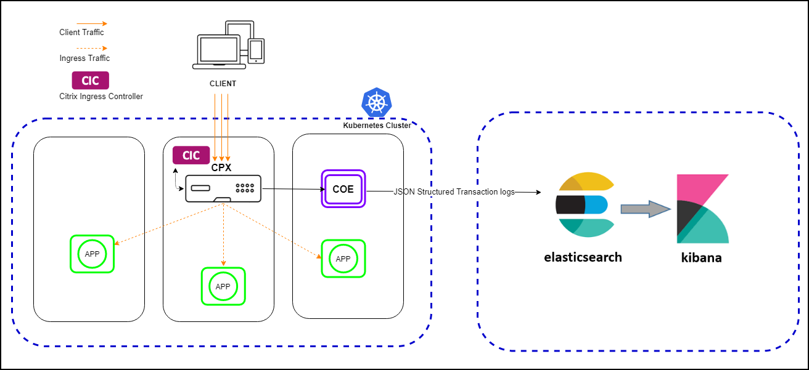

### Prerequisites

  -  Ensure that you have a Kubernetes cluster with `kube-dns` or `CoreDNS` addon enabled.

In the following procedure, the YAML file is used to deploy Citrix ADC Observability Exporter in the Kubernetes *defauIt* namespace. If you want to deploy in a private namespace other than the *default*, edit the YAML file to specify the namespace.

Perform the following steps to deploy Citrix Observability Exporter:

**Note**: If you have a pre-deployed web application, skip the steps 1 and 2.

  1.  Create a secret [ingress.crt](https://github.com/citrix/citrix-observability-exporter/blob/master/examples/ingress.crt) and key [ingress.key](https://github.com/citrix/citrix-observability-exporter/blob/master/examples/ingress.key) using your own certificate and key.
  
      In this example, a secret, called *ing* in the default namespace, is created.

          kubectl create secret tls ing --cert=ingress.crt --key=ingress.key

  2.  Access the YAML file from [webserver-es.yaml](https://raw.githubusercontent.com/citrix/citrix-observability-exporter/master/examples/elasticsearch/webserver-es.yaml) to deploy the application.

          kubectl create -f webserver-es.yaml

  3.  Define the specific parameters that you must import by specifying it in the ingress annotations of the application's YAML file, using the smart annotations in the ingress.

          ingress.citrix.com/analyticsprofile: '{"webinsight": {"httpurl":"ENABLED", "httpuseragent":"ENABLED", "httpHost":"ENABLED","httpMethod":"ENABLED","httpContentType":"ENABLED"}}'

      **Note**: The parameters are predefined in the `webserver-es.yaml` file.

      For more information about Annotations, see [Ingress annotations help](https://github.com/citrix/citrix-k8s-ingress-controller/blob/666d6267e5b09683740528c5e8dd46f16d7d16e0/docs/configure/annotations.md).

## Deploy Citrix ADC CPX with the Citrix ADC Observability Exporter support

You can deploy Citrix ADC CPX as a side car with the Citrix ADC Observability Exporter support enabled along with Citrix ingress controller. You can modify the Citrix ADC CPX YAML file `cpx-ingress-es.yaml` to include the configuration information that is required for the Citrix ADC Observability Exporter support.

Perform the following steps to deploy a Citrix ADC CPX instance with the Citrix ADC Observability Exporter support:

  1.  Download the [cpx-ingress-es.yaml](https://raw.githubusercontent.com/citrix/citrix-observability-exporter/master/examples/elasticsearch/cpx-ingress-es.yaml) and [cic-configmap.yaml](https://raw.githubusercontent.com/citrix/citrix-observability-exporter/master/examples/elasticsearch/cic-configmap.yaml) file.

          kubectl create -f cic-configmap.yaml
          kubectl create -f cpx-ingress-es.yaml
  2.  Modify Citrix ADC CPX related parameters, as required.For example, add lines under args in the cpx-ingress-es.yaml file as following:

          args:
             - --configmap
               default/cic-configmap


  4.  Edit the `cic-configmap.yaml` file and specify the following variables for Citrix ADC Observability Exporter in the `NS_ANALYTICS_CONFIG` endpoint configuration.

          server: 'coe-es.default.svc.cluster.local' # COE service FQDN
  
   **Note**: If you have used a namespace other than *default*, change `coe-es.default.svc.cluster.local to` to `coe-es.<desired-namespace>.svc.cluster.local`. If ADC is outside the Kubernetes cluster, then you must specify IP address and nodport address of Citrix ADC Observability Exporter.

## Deploy Elasticsearch and Kibana using YAML files

  1.  Download the Elasticsearch YAML file from [elasticsearch.yaml](https://raw.githubusercontent.com/citrix/citrix-observability-exporter/master/examples/elasticsearch/elasticsearch.yaml) and the Kibana YAML file from [kibana.yaml](https://raw.githubusercontent.com/citrix/citrix-observability-exporter/master/examples/elasticsearch/kibana.yaml).

  2.  Edit the namespace definition, if you want to use a different namespace other than *default*.

  3.  Run the following commands to deploy Elasticsearch and Kibana:

          kubectl create -f elasticsearch.yaml
          kubectl create -f kibana.yaml
  
  **Note**: Elasticsearch and Kibana are deployed in the default namespace of the same Kubernetes cluster.

## Deploy Citrix ADC Observability Exporter using the YAML file

  You can deploy Citrix Observability Exporter using the YAML file. Download the YAML file from [coe-es.yaml](https://raw.githubusercontent.com/citrix/citrix-observability-exporter/master/examples/elasticsearch/coe-es.yaml).

  To deploy Citrix Observability Exporter using the Kubernetes YAML, run the following command in the Elasticsearch endpoint:
    
      kubectl create -f coe-es.yaml

 **Note**: Modify the YAML file for Citrix ADC Observability Exporter if you have a custom namespace.
  
## Verify the Citrix ADC Observability Exporter deployment

To verify the Citrix ADC Observability Exporter deployment, perform the following:

  1.  Verify the deployment using the following command:

           kubectl get deployment,pods,svc -o wide

      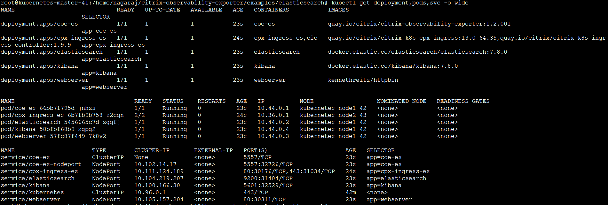

  2.  Access the application with a browser using the URL: `https://kubernetes-node-IP:cpx-ingress-es nodeport/`.
  
      For example, from Step 1, access http://10.102.40.41:30176/ in which, `10.102.40.41` is one of the Kubernetes node IPs.

      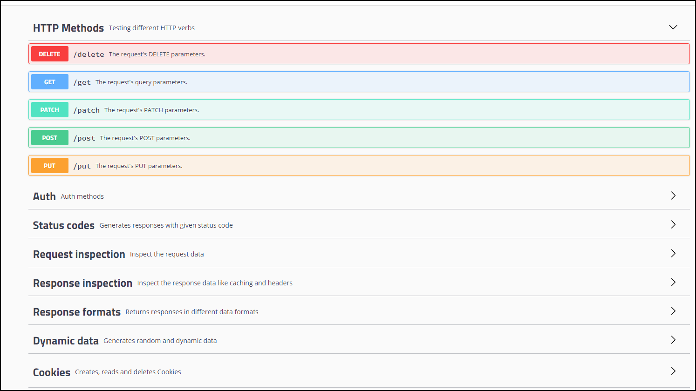
  
  3.  Access Kibana with a browser using the URL: `https://<kubernetes-node-IP>:<kibana nodeport>/`.

      For example, from step 1, access http://10.102.40.41:32529/ in which, `10.102.40.41` is one of the Kubernetes node IPs.
   
      a. Click **Explore on my own**.

       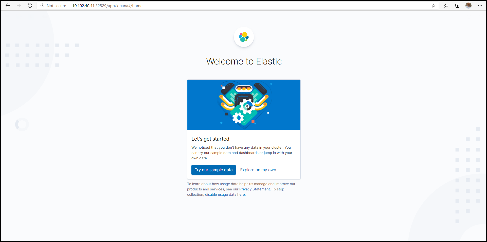

      b. Click **Connect to your Elasticsearch index**.

        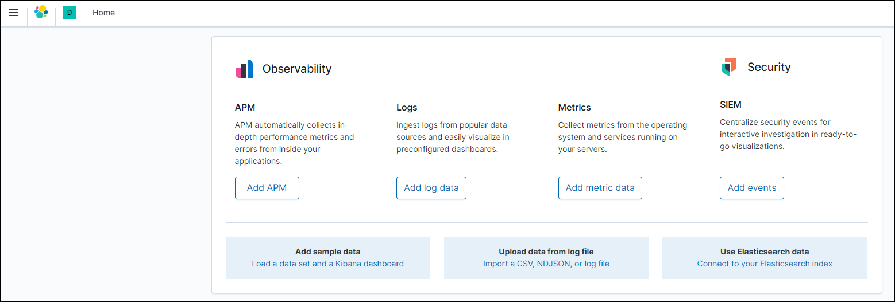

      c. Click **Saved Objects**.
   
      d. Download and import the Kibana Dashboard from [KibanaAppTrans.ndjson](https://raw.githubusercontent.com/citrix/citrix-observability-exporter/master/dashboards/KibanaAppTrans.ndjson).
   
       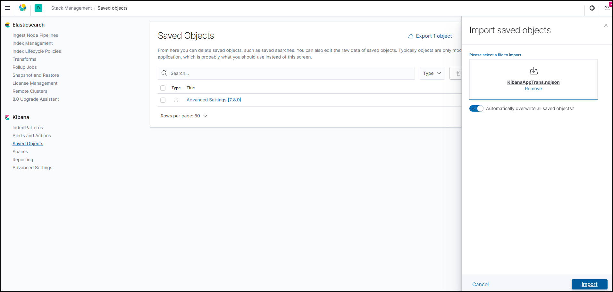

      e. Click **App Transaction dashboard**.

       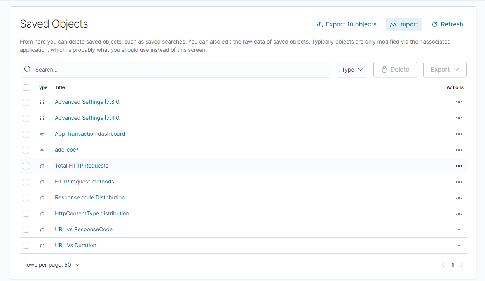

        The dashboard appears.

       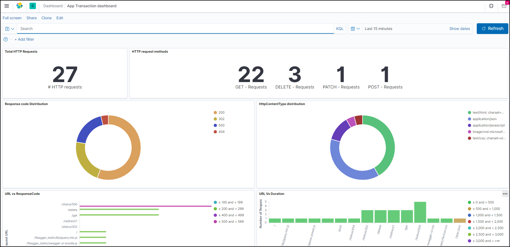

       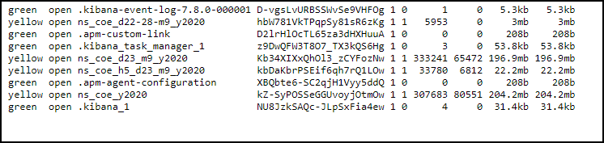

## Integrate Citrix ADC with multiple Citrix ADC Observability Exporter instances manually

You can also configure Citrix ADC Observability Exporter manually. We recommend deploying Citrix ADC Observability Exporter in an automated way with the YAML file as described in the preceding sections. You can also perform manual configuration for Citrix ADC in the MPX and VPX form factors.

```
enable feature appflow
enable ns mode ULFD
add dns nameserver <KUBE-CoreDNS>
add server COEsvr <FQDN/IP>
add servicegroup COEsvcgrp LOGSTREAM  -autoScale DNS
bind servicegroup COEsvcgrp COEsvr <PORT>
add lb vserver COE LOGSTREAM 0.0.0.0 0
bind lb vserver COE COEsvcgrp
add analytics profile web_profile -collectors COE -type webinsight -httpURL ENABLED -httpHost ENABLED -httpMethod ENABLED -httpUserAgent ENABLED -httpContentType ENABLED
add analytics profile tcp_profile -collectors COE -type tcpinsight
bind lb vserver <WEB-VSERVER> -analyticsProfile web_profile
bind lb vserver <WEB-VSERVER> -analyticsProfile tcp_profile
 
# To enable metrics push to prometheus
add service metrichost_SVC <IP> HTTP <PORT>
set analyticsprofile ns_analytics_time_series_profile -collectors metrichost_SVC -metrics ENABLED -outputMode prometheus

```
Add Citrix ADC Observability Exporter using FQDN

```
enable feature appflow
enable ns mode ULFD
add dns nameserver <KUBE-CoreDNS>
add server COEsvr <FQDN>
add servicegroup COEsvcgrp LOGSTREAM  -autoScale DNS
bind servicegroup COEsvcgrp COEsvr <PORT> 
add lb vserver COE LOGSTREAM 0.0.0.0 0
bind lb vserver COE COEsvcgrp
add analytics profile web_profile -collectors COE -type webinsight -httpURL ENABLED -httpHost ENABLED -httpMethod ENABLED -httpUserAgent ENABLED -httpContentType ENABLED
add analytics profile tcp_profile -collectors COE -type tcpinsight
bind lb vserver <WEB-VSERVER> -analyticsProfile web_profile
bind lb vserver <WEB-VSERVER> -analyticsProfile tcp_profile

# To enable metrics push to prometheus
add service metrichost_SVC <IP> HTTP <PORT>
set analyticsprofile ns_analytics_time_series_profile -collectors metrichost_SVC -metrics ENABLED -outputMode prometheus

```

To verify if Citrix ADC sends application data logs to Citrix ADC Observability Exporter:

      nsconmsg -g lstream_tot_trans_written -d current

  The counter value indicates that the number of application transactions (for example, HTTP transactions) which have been sent to Citrix ADC Observability Exporter.

  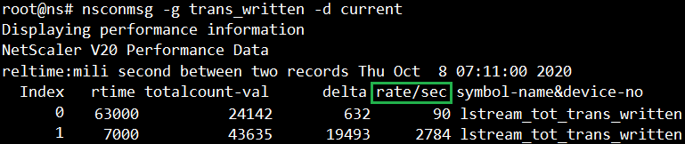

  If the application traffic rate (for example, HTTP req/sec) that is sent to Citrix ADC Observability Exporter is not equal to `lstream_tot_trans_written`, you can verify the same using the following command:

      nsconmsg -g nslstream_err_ulf_data_not_sendable -d current

  The counter value indicates that Citrix ADC cannot send the data to Citrix ADC Observability Exporter due to network congestion, unavailability of network bandwidth, and so on. The data is stored in the available buffers.

  Information about various transaction data and individual fields, and their datatype are available in the following location on the Citrix ADC:

      shell
      /netscaler/appflow/ns_ipfix.yaml

  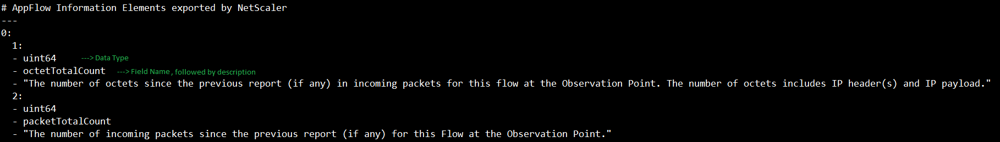

  To verify that if application transaction records are exported from Citrix ADC to Citrix ADC Observability Exporter, use the following command:

    nsconmsg -g appflow_tmpl -d current

  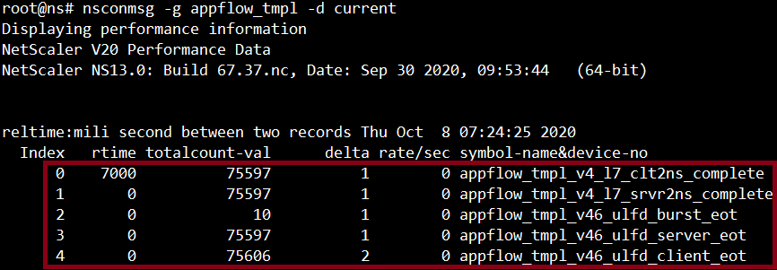

  Location of metrics data export logs to Citrix ADC for time series data:

          /var/nslog/metrics_prom.log

  To verify Elasticsearch related counters, run the following command:

          kubectl exec -it <cpx-pod-name> [-c <cpx-container-name>] [-n <namespace-name>] -- bash

          tail -f /var/ulflog/counters/lstrmd_counters_codes.log | grep -iE "(http_reqs_done|elk)"

  Find the logs in the following location to verify that the Citrix ADC Observability Exporter configuration is applied correctly:

          vi /var/logproxy/lstreamd/conf/lstreamd.conf

  If Citrix ADC Observability Exporter fails, you can collect logs and files available at the following location and contact Citrix Support.

          /cores/ (Loation of the coredump files, if any.)
          /var/ulflog/ (Location of the `libulfd` logs and counter details.)
          /var/log  (Location of the console logs, lstreamd logs and so on.)

  For information on troubleshooting related to Citrix ADC Observability Exporter, see [Citrix ADC CPX troubleshooting](https://docs.citrix.com/en-us/citrix-adc-cpx/current-release/cpx-troubleshooting.html).
