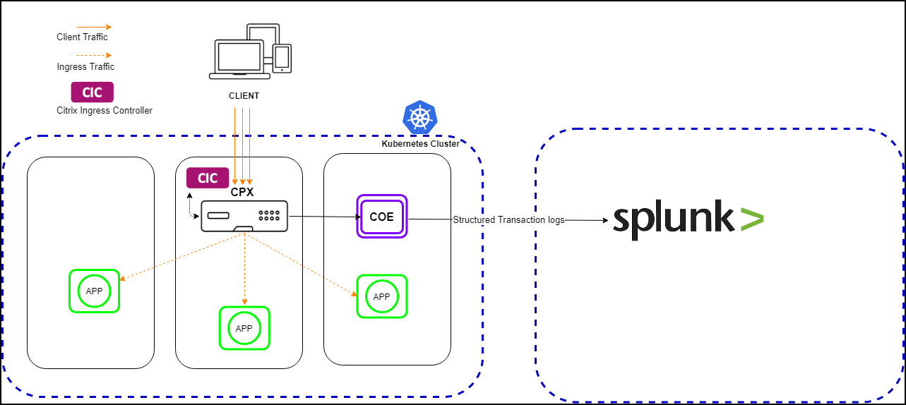
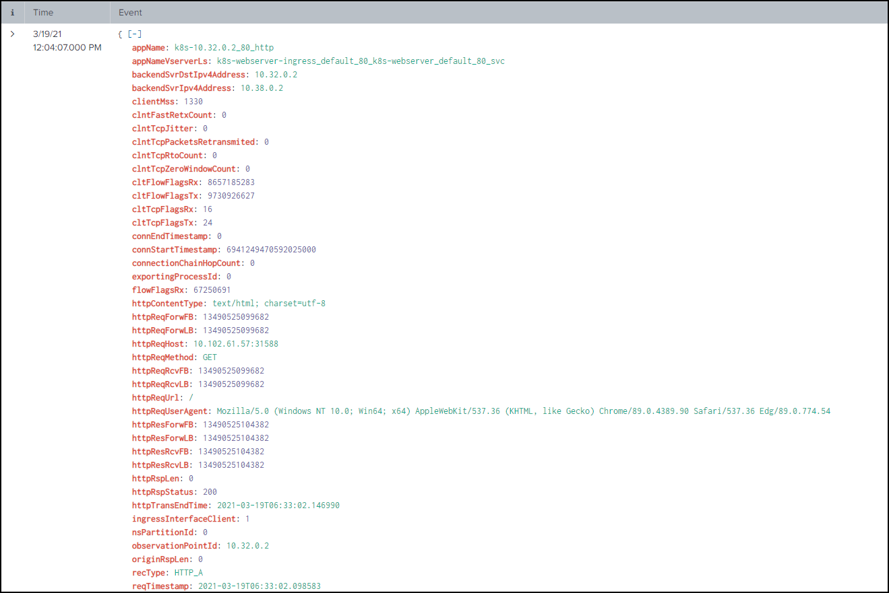

# Citrix ADC Observability Exporter with Splunk Enterprise as endpoint

Citrix ADC Observability Exporter is a container that collects metrics and transactions from Citrix ADC and sends the data to various endpoints. Citrix ADC Observability Exporter supports Splunk Enterprise as an endpoint.

Splunk Enterprise is a data platform for searching, monitoring, and analyzing machine-generated big data. Splunk Enterprise captures indexes and correlates real-time data in a repository from which it can generate reports, graphs, dashboards, and visualizations.

You can add Splunk Enterprise as an endpoint to receive audit logs, events, and transactions from Citrix ADC for analysis. Splunk Enterprise provides a graphical representation of these data. You can enable or disable the type of transactions, events, and audit logs which are to be sent to Splunk Enterprise.

## Deploy Citrix ADC Observability Exporter

You can deploy Citrix ADC Observability Exporter using the YAML file. Based on your Citrix ADC deployment, you can deploy Citrix ADC Observability Exporter either outside or inside Kubernetes clusters. You can deploy Citrix ADC Observability Exporter as a pod inside the Kubernetes cluster or on the Citrix ADC MPX or VPX appliance outside the cluster.

The following diagram illustrates a Citrix ADC as an Ingress Gateway with the Citrix ingress controller and Citrix ADC Observability Exporter as sidecars. Citrix ADC Observability Exporter sends Citrix ADC application metrics and transaction data to Splunk Enterprise. Splunk Enterprise provides a graphical representation of the data.

  

**Prerequisites**

  -  Ensure that you have a Kubernetes cluster with `kube-dns` or `CoreDNS` addon enabled.

**Note**: In the following procedure, the YAML file is used to deploy Citrix ADC Observability Exporter in the Kubernetes *defauIt* namespace. If you want to deploy in a private namespace other than the *default*, edit the YAML file to specify the namespace.

Perform the following steps to deploy Citrix ADC Observability Exporter:

**Note**: If you have a pre-deployed web application, skip the steps 1 and 2.

  1.  Create a secret [ingress.crt](https://github.com/citrix/citrix-observability-exporter/blob/master/examples/ingress.crt) and key [ingress.key](https://github.com/citrix/citrix-observability-exporter/blob/master/examples/ingress.key) using your own certificate and key.
  
      In this example, a secret, called *ing* in the default namespace, is created.

          kubectl create secret tls ing --cert=ingress.crt --key=ingress.key

  2.  Access the YAML file from [webserver-splunk.yaml](https://raw.githubusercontent.com/citrix/citrix-observability-exporter/master/examples/splunk/webserver-splunk.yaml) to deploy the application.

          kubectl create -f webserver-splunk.yaml

  3.  Define the specific parameters that you must import by specifying it in the ingress annotations of the application's YAML file, using the smart annotations in the ingress.

          ingress.citrix.com/analyticsprofile: '{"webinsight": {"httpurl":"ENABLED", "httpuseragent":"ENABLED", "httpHost":"ENABLED","httpMethod":"ENABLED","httpContentType":"ENABLED"}}'

      **Note**: The parameters are predefined in the `webserver-splunk.yaml` file.

      For more information about Annotations, see [Ingress annotations documentation](https://github.com/citrix/citrix-k8s-ingress-controller/blob/666d6267e5b09683740528c5e8dd46f16d7d16e0/docs/configure/annotations.md).

## Deploy Citrix ADC CPX with the Citrix ADC Observability Exporter support

You can deploy Citrix ADC CPX as a side car with the Citrix ADC Observability Exporter support enabled along with Citrix ingress controller. You can modify the Citrix ADC CPX YAML file `cpx-ingress-splunk.yaml` to include the configuration information that is required for the Citrix ADC Observability Exporter support.

Perform the following steps to deploy a Citrix ADC CPX instance with the Citrix ADC Observability Exporter support:

  1.  Download the [cpx-ingress-splunk.yaml](https://raw.githubusercontent.com/citrix/citrix-observability-exporter/master/examples/splunk/cpx-ingress-splunk.yaml) and [cic-configmap.yaml](https://raw.githubusercontent.com/citrix/citrix-observability-exporter/master/examples/splunk/cic-configmap.yaml) file.
  2.  Modify Citrix ADC CPX related parameters, as required.
  3.  Edit the `cic-configmap.yaml` file and specify the following variables for Citrix ADC Observability Exporter in the `NS_ANALYTICS_CONFIG` endpoint configuration.

          server: 'coe-splunk.default.svc.cluster.local' # COE service FQDN
  
   **Note**: If you have used a namespace other than *default*, change `coe-splunk.default.svc.cluster.local to` to `coe-splunk.<desired-namespace>.svc.cluster.local`. If Citrix ADC is outside the Kubernetes cluster, then you must specify IP address and nodport address of Citrix ADC Observability Exporter.

## Deploy Citrix ADC Observability Exporter using the YAML file

  You can deploy Citrix ADC Observability Exporter using the YAML file. Download the YAML file from [coe-splunk.yaml](https://raw.githubusercontent.com/citrix/citrix-observability-exporter/master/examples/splunk/coe-splunk.yaml). Ensure to specify the Splunk server address for the right namespace.

  **Note**: While deploying Citrix ADC Observability Exporter using the YAML file, along with the Splunk server address, you can provide the `Index` name to which the data to be sent in Splunk Enterprise. By default, this `IndexPrefix` option is empty and the data is uploaded to the default index, that is `main`, in Splunk Enterprise.

  To deploy Citrix ADC Observability Exporter using the Kubernetes YAML, run the following command in the Splunk Enterprise endpoint:
    
      kubectl create -f coe-splunk.yaml

 **Note**: Modify the YAML file for Citrix ADC Observability Exporter if you have a custom namespace.
  
## Verify the Citrix ADC Observability Exporter deployment

You can verify the deployment after deploying Citrix ADC Observability Exporter, web application, Citrix ADC CPX, and Citrix ingress controller.

To verify the deployment, perform the following steps:

  1.  Verify the deployment using the following command:

          kubectl get deployment,pods,svc -o wide

  2.  Access the application using a browser with the URL. For example, https://kubernetes-node-IP:cpx-ingress-splunk nodeport/.

  3.  Access the Splunk server using a browser with the URL. For example, https://splunk-node-IP:splunk nodeport/.

      