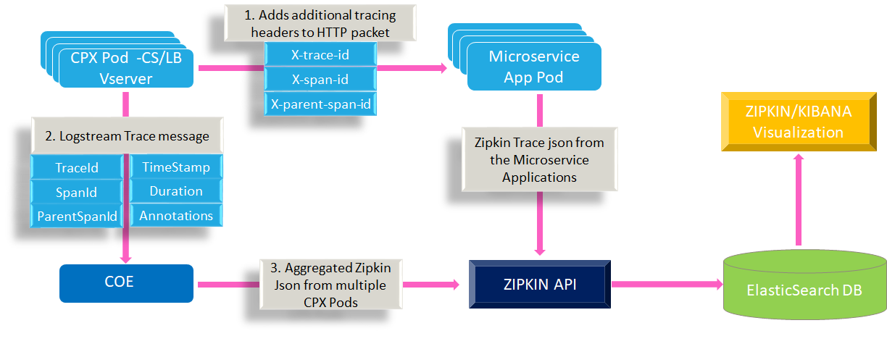
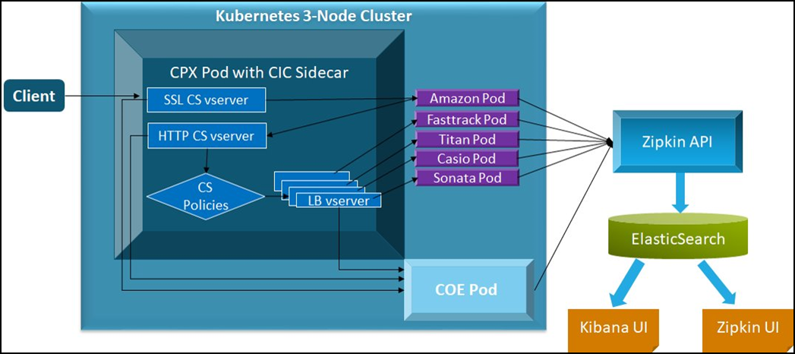
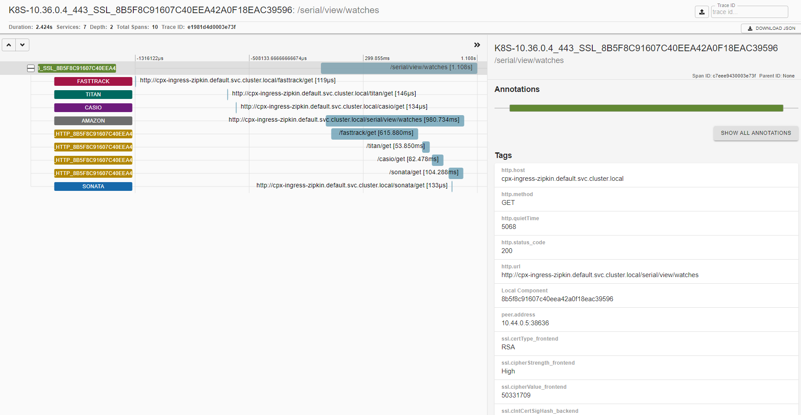
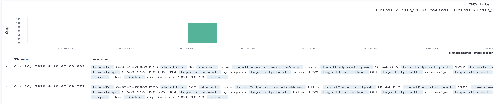

# Citrix ADC Observability Exporter with Zipkin as endpoint

Citrix Observability Exporter supports OpenTracing (OpenTracing is a part of OpenTelemetry now) using [Zipkin](https://zipkin.io/) as the endpoint. Citrix Observability Exporter transforms the tracing data collected from Citrix ADCs into supported formats suitable for OpenTracing and exports them to Zipkin. Zipkin is a distributed tracing system that helps to gather the timing data required to troubleshoot latency problems in microservice architectures. Elasticsearch is used for long-term retention of trace data and the traces can be visualized using the Zipkin UI or Kibana.

The following diagram illustrates how the Zipkin architecture works:

1. When the tracing is enabled, initially, it adds additional open-tracing headers: `x-trace-id`, `x-span-id`, and `x-parent-span-id` to HTTP packet, before it forwards the packet to the next microservice pod.

2. The information about this communication or transaction is pushed to Citrix ADC Observability Exporter. The information includes the details about the headers, the timestamp (time when this request is initiated and the entire duration of the process), and annotations (annotations include HTTP, SSL, and TCP associated with that request).

3. Then, Citrix ADC Observability Exporter receives multiple trace messages from all the Citrix ADCs and aggregates them into Zipkin understandable JSON format, and push that to Zipkin through the API.

4. Similarly, if microservices are enabled with tracing, then that trace is sent to Zipkin through the API.

5. Zipkin API stores the trace data in the Elasticsearch database, and finally stitch the complete trace to the given HTTP request and visualize it in the visualization tool such as Kibana. You can view the time that the request spent on each microservices.

## Deploy Citrix ADC Observability Exporter

Based on your Citrix ADC deployment, you can deploy Citrix Observability Exporter either outside or inside Kubernetes clusters. You can deploy Citrix Observability Exporter as a pod inside the Kubernetes cluster or enable the configuration on Citrix ADC MPX or VPX form factor outside the cluster. You can deploy Citrix Observability Exporter using the Kubernetes YAML file provided by Citrix.

The following diagram illustrates Citrix ADC as an ingress gateway with the Citrix ingress controller as a sidecar. Citrix Observability Exporter sends the tracing data collected from Citrix ADCs to Zipkin API. The tracing data is, then, uploaded to the Elasticsearch server. From Elasticsearch, the data is sent to Zipkin UI or Kibana UI for visualization.

  

### Prerequisites

  -  Ensure that you have a Kubernetes cluster with `kube-dns` or `CoreDNS` addon enabled.

To deploy Citrix Observability Exporter with Zipkin, you must perform the following tasks:

1. Deploy the required application with the tracing support enabled.
2. Deploy Citrix ADC CPX enabled with the Citrix Observability Exporter support.
3. Deploy Zipkin, Elasticsearch, and Kibana using the YAML files.
4. Deploy Citrix Observability Exporter using the YAML file.

## Deploy application with tracing enabled

To deploy a sample application with tracing enabled, perform the following steps:

**Note**: If you have a pre-deployed web application, skip the steps 1 and 2.

  1.  Create a secret using the certificate and key. Access the certificate from [ingress.crt](https://github.com/citrix/citrix-observability-exporter/blob/master/examples/ingress.crt) and the key from [ingress.key](https://github.com/citrix/citrix-observability-exporter/blob/master/examples/ingress.key). You can also use your own certificate and key.
  
      In this example, a secret, called *ing* in the default namespace, is created.

          kubectl create secret tls ing --cert=ingress.crt --key=ingress.key

  2.  Access the YAML file from [watches-app-tracing.yaml](https://raw.githubusercontent.com/citrix/citrix-observability-exporter/master/examples/tracing/watches-app-tracing.yaml) to deploy the application.

          kubectl create -f watches-app-tracing.yaml

  3.  Define the specific parameters that you must import by specifying it in the ingress annotations of the application's YAML file, using the smart annotations in the ingress.

          ingress.citrix.com/analyticsprofile: '{"webinsight": {"httpurl":"ENABLED", "httpuseragent":"ENABLED", "httpHost":"ENABLED","httpMethod":"ENABLED","httpContentType":"ENABLED"}}'

      **Note**: The parameters are predefined in the `watches-app-tracing.yaml` file.

      For more information about annotations, see [Ingress annotations](https://github.com/citrix/citrix-k8s-ingress-controller/blob/666d6267e5b09683740528c5e8dd46f16d7d16e0/docs/configure/annotations.md).

## Deploy Citrix ADC CPX with the Citrix ADC Observability Exporter support

You can deploy Citrix ADC CPX enabled with the Citrix ADC Observability Exporter support.

While deploying Citrix ADC CPX, you can modify the deployment YAML file `cpx-ingress-tracing.yaml` to include the configuration information that is required for the Citrix ADC Observability Exporter support.

Perform the following steps to deploy a Citrix ADC CPX instance with the Citrix ADC Observability Exporter support:

  1.  Download the [cpx-ingress-tracing.yaml](https://raw.githubusercontent.com/citrix/citrix-observability-exporter/master/examples/tracing/cpx-ingress-tracing.yaml) and [cic-configmap.yaml](https://raw.githubusercontent.com/citrix/citrix-observability-exporter/master/examples/elasticsearch/cic-configmap.yaml) file.

          kubectl create -f cpx-ingress-tracing.yaml
          kubectl create -f cic-configmap.yaml

  2.  Modify Citrix ADC CPX related parameters, as required. For example, add lines under `args` in the `cpx-ingress-tracing.yaml` file as following:

          args:
            - --configmap
              default/cic-configmap

  3.  Edit the `cic-configmap.yaml` file to specify the following variables for Citrix ADC Observability Exporter in the `NS_ANALYTICS_CONFIG` endpoint configuration.

          server: 'coe-zipkin.default.svc.cluster.local' # COE service FQDN
  
  **Note**: If you have used a namespace other than *default*, change `coe-zipkin.default.svc.cluster.local` to `coe-zipkin.<desired-namespace>.svc.cluster.local`. If ADC is outside the Kubernetes cluster, then you must specify IP address and Nodport address of Citrix ADC Observability Exporter.

## Deploy Zipkin, Elasticsearch, and Kibana using YAML files

  To deploy Zipkin, Elasticsearch, and Kibana using YAML, perform the following steps:

 1.  Download the following YAML files:
  
      - [zipkin.yaml](https://raw.githubusercontent.com/citrix/citrix-observability-exporter/master/examples/tracing/zipkin.yaml)

      - [Elasticsearch.yaml](https://raw.githubusercontent.com/citrix/citrix-observability-exporter/master/examples/elasticsearch/elasticsearch.yaml)

      - [kibana.yaml](https://raw.githubusercontent.com/citrix/citrix-observability-exporter/master/examples/elasticsearch/kibana.yaml)

  2.  Edit the namespace definition, if you want to use a custom namespace other than the *default*.

  3.  Run the following commands to deploy Zipkin, Elasticsearch, and Kibana:

          kubectl create -f zipkin.yaml
          kubectl create -f elasticsearch.yaml
          kubectl create -f kibana.yaml
  
  **Note**: Zipkin, Elasticsearch, and Kibana are deployed in the default namespace of the same Kubernetes cluster.

## Deploy Citrix ADC Observability Exporter using the YAML file

  You can deploy Citrix Observability Exporter using the YAML file. Download the [coe-zipkin.yaml](https://raw.githubusercontent.com/citrix/citrix-observability-exporter/master/examples/tracing/coe-zipkin.yaml) file.

  To deploy Citrix Observability Exporter using the Kubernetes YAML, run the following command in the Elasticsearch endpoint:
    
      kubectl create -f coe-zipkin.yaml

 **Note**: Modify the YAML file for Citrix ADC Observability Exporter if you have a custom namespace other than the default.
  
## Verify the Citrix ADC Observability Exporter deployment

To verify the Citrix ADC Observability Exporter deployment, perform the following:

  1.  Verify the deployment by sending a request to the application using the following command.

          kubectl run -i --tty busybox --image=busybox --restart=Never --rm -- wget --no-check-certificate "https://cpx-ingress-zipkin.default.svc.cluster.local/serial/view/watches"

  2.  Open the Zipkin user interface using the Kubernetes node IP address and nodeport.

           http://*k8-node-ip-address*:*node-port*/
  
       In the following image, you can view the traces of the *Watches* application. The *Watches* application has multiple microservices for each watches type, communicating with each other to serve the application data. The trace data shows application `FASTTRACK` took more time to serve when compare to other micro services. In this way, you can identify the slow performing  workloads and troubleshoot it.

       
  
       You can view raw data on your Kibana dashboard too. Open Kibana using the `http://<node-ip>:<node-port>` and commence with defining a *zipkin* index pattern.
       
       Use the `timestamp_millis` field as the timestamp field. After creating the index pattern, click the **Discover** tab and you can view the trace information collected by Zipkin.

       

        For information on troubleshooting related to Citrix ADC Observability Exporter, see [Citrix ADC CPX troubleshooting](https://docs.citrix.com/en-us/citrix-adc-cpx/current-release/cpx-troubleshooting.html).